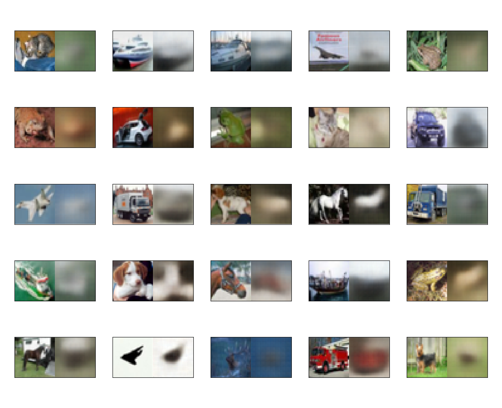
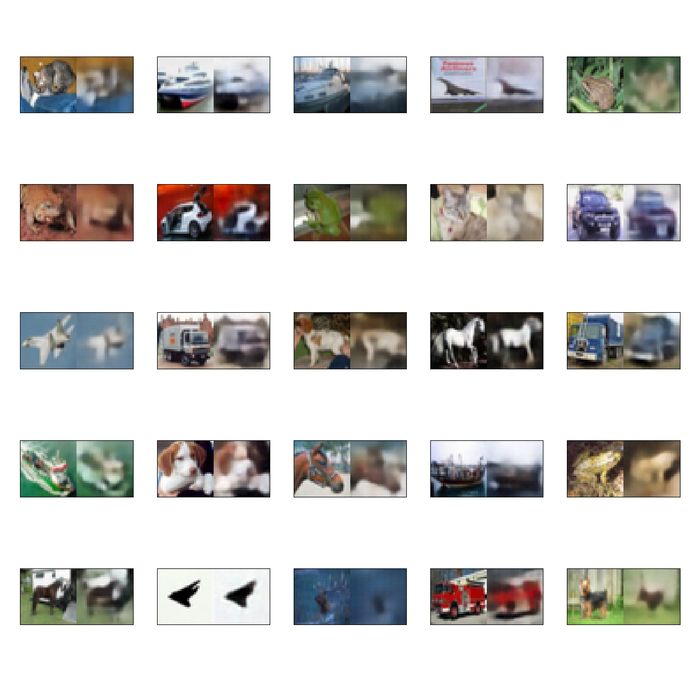

# Variational Autoencoder (VAE)
### How To Run

```make
# Training/Testing
make train
make test
```

### Implementation Notes
The most challenging part regarding VAE implementation (training) is: 

	1) The selection of the latent space dimension
	2) The balance between reconstruction and generation
	
Latent space dimension (z-dim) corresponds to the compression ratio of the encoder (e.g. 32x32x3 input image with z-dim of 100 corresponds to (32x32x3)/100 ~ 22x compression), therefore, if z-dim is too small, meaning that the compression is too high, the representation (reconstruction and generation) capability of the VAE is limited .

The cost function of the VAE constitutes of the reconstruction (R) loss and the KL-Divergence Loss (KLD). Often we find the training result to be notoriously difficult to evaluate. The main reason is the numerical balance between R and KLD loss. If these two losses are not **normalized** properly to exhibit similar magnitude, the training process equivalently gives rise to whatever loss that has a higher order of magnitude, causing the result of the VAE training to be undesirable. Provided with some heuristic, a rule-of-thumb for the loss function as well as the normalization is summarized in the following:

	1) R-loss: take sum of squared error and normalize by input-dim (i.e. HxWxC)
	2) KLD-loss: take sum of KL term and normalize by z-dim(latent dimesion) 

In addition, given proper normalization, the essence of VAE is striking the balance between R and KLD, specifically, if there is perfect reconstruction, then one can view the trained VAE as not learning anything about sampling from the latent distribution. Conversely, if the KLD loss is extremely low, this means that the VAE does not take reconstruction seriously, and may generate results that have minor resemblance with the input. The following table and sample results from the CIFAR10 dataset illustrate some experimental results:

|Z-dim   |Beta   |KLD-loss   |R-loss   |
|-----------|----------|---------------|-----------|
|10        |0.1     |~80         |~3.0    |
|100      |0.1     |~11          |~2.5   |
|100      |0.05   |~20          |~2.2   |
|100      |0.01   |~64          |~1.0   |
|100      |0.005  |~85         |~0.8   |

{width=50%}
**Fig. 1: Z-dim = 100; Beta = 0.1 (poor reconstruction, good generation)**
{width=50%}
**Fig. 1: Z-dim = 100; Beta = 0.005 (good reconstruction, poor generation)**
